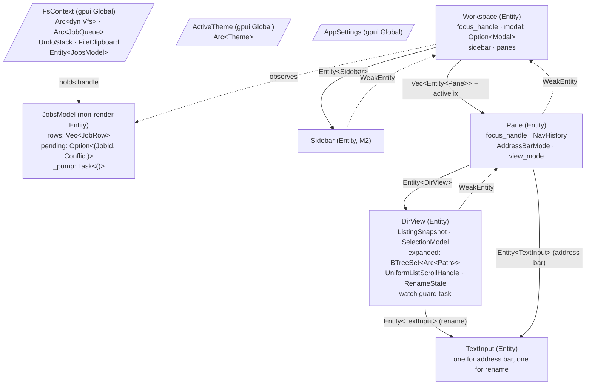
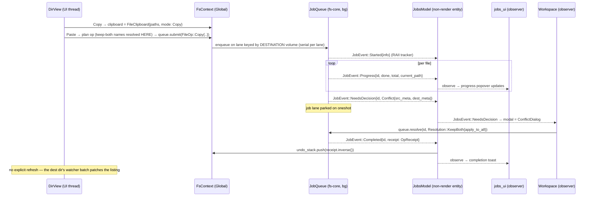

# file-explorer Architecture

**How to use this document.** This is the working technical reference for building file-explorer, sitting between the product plan (`docs/file-explorer-plan.md`) and the living build record (`docs/AS_BUILT.md`). Read §0 before touching `keymap.rs` — it is the source of truth for every binding. Read §5–§6 before writing any code that touches the disk. Read §10 to know what your current milestone requires and what it must *not* require. When this document and the code disagree, either the code is wrong or this document needs a PR — AS_BUILT records what exists; this records what everything is supposed to converge to. The Decisions table at the end records why each load-bearing choice was made and what would cause us to revisit it.

**Design bias:** the smallest architecture that ships M1 (read-only browsing) cleanly, where every later milestone is *additive* — new modules, new entities, new enum variants — never a rewrite of something M1 shipped. Every load-bearing seam (Vfs, Spawner, SelectionModel, actions, JobsModel) exists from M1 in its final shape, even if its M1 implementation is trivial.

---

## 0. Behavior → action traceability table

This table is the **literal source of truth for `crates/app/src/keymap.rs`** and a checked-in traceability artifact: every behavior row from plan §3 (and the §2 blueprint details that imply input handling) maps to exactly one action, one key context, and one owning handler. When a binding changes, this table changes in the same PR. `#[gpui::test]` dispatch tests (§9) assert each context's bindings actually fire.

> **Backspace resolution (macOS keyboard):** gpui names the large key `backspace` and fn-forward-delete `delete`. Explorer semantics map cleanly: `backspace` → `GoUp`, `delete` → `DeleteToTrash`, `shift-delete` → `DeletePermanently`. There is no conflict; the two §3 rows ("Delete key" and "Backspace goes up") bind different physical keys.

| Plan ref | Behavior | Trigger(s) | Action | Key context | Handler | Milestone |
|---|---|---|---|---|---|---|
| §3 Open item | Open file / enter folder | `enter`, double-click | `OpenSelected` | `DirView && !renaming` | DirView | M1 |
| §3 Rename | Inline rename, stem pre-selected | `f2`; **slow second click** on an already-selected row (a single click landing after the double-click interval) | `RenameSelected` | `DirView && !renaming` | DirView | M3 |
| §3 Rename | Commit rename | `enter` | `Confirm` | `TextInput` | TextInput → DirView | M3 |
| §3 Rename | Cancel rename | `escape` | `Cancel` | `TextInput` | TextInput → DirView | M3 |
| §3 Delete | Delete to trash, no modifier | `delete` | `DeleteToTrash` | `DirView && !renaming` | DirView | M3 |
| §3 Delete | Bypass trash (confirm dialog first) | `shift-delete` | `DeletePermanently` | `DirView && !renaming` | DirView | M3 |
| §3 Go up | Parent directory | `backspace`, `alt-up` | `GoUp` | `DirView && !renaming` | Pane | M1 |
| §3 (history) | Back / Forward, restoring cursor + scroll | `cmd-[` / `cmd-]`, mouse buttons 4/5 | `GoBack` / `GoForward` | `Pane` | Pane | M1 |
| §3 Address bar | Breadcrumb → editable path | `cmd-l`, click in breadcrumb blank space | `FocusAddressBar` | `Workspace` | Pane | M1 |
| §3 Address bar | Accept autocomplete suggestion | `tab` | `AcceptSuggestion` | `AddressBar` | address_bar | M1 |
| §3 Address bar | Navigate to typed path / abort edit | `enter` / `escape` | `Confirm` / `Cancel` | `TextInput` | TextInput → Pane | M1 |
| §3 Cut/paste | Cut (dim sources), Copy, Paste (move on cut) | `cmd-x` / `cmd-c` / `cmd-v` | `Cut` / `Copy` / `Paste` | `DirView && !renaming` | DirView → FsContext | M3 |
| §3 New folder/file | New folder | `cmd-shift-n`, context menu | `NewFolder` | `Pane` | Pane → DirView | M3 |
| §3 New folder/file | New text file | context menu **New ▸ Text file…** | `NewFile` | `Pane` | Pane → DirView | M3 |
| §8 Context menu | Open the row / background context menu | **right-click** (mouse, not keymap; macOS ctrl-click arrives as one) | — (the menu's rows dispatch the boxed actions in this table) | — | DirView / context_menu | M3 |
| §8 Context menu | Dismiss the open context menu | `escape` (a click anywhere also dismisses) | `Cancel` | `DirView && menu` | DirView | M3 |
| toolbar | Duplicate selection | `cmd-d`, toolbar | `Duplicate` | `DirView && !renaming` | DirView | M3 |
| §3 Sorting | Sort by column, arrow indicator, folders-first | header click | `SortBy { key }` | — (mouse dispatch) | DirView | M1 |
| §3 Selection | Select all | `cmd-a` | `SelectAll` | `DirView && !renaming` | DirView | M1 |
| §3 Selection | Click / `cmd`-click toggle / `shift`-click range / rubber-band | mouse (not keymap) | — (SelectionModel mutations) | — | DirView / marquee | M1 (multi: M3) |
| §3 Selection | Cursor movement (+`shift-` extends) | `up` `down` `home` `end` `pageup` `pagedown` | `SelectNext/Prev/First/Last`, `ExtendSelectionNext/Prev`, `PageUp/PageDown` | `DirView && !renaming` | DirView | M1 |
| §2 Views | Expand folder in place (disclosure triangle) | `right`, triangle click | `ExpandSelected` | `DirView && !renaming` | DirView | M2 |
| §2 Views | Collapse in-place folder | `left`, triangle click | `CollapseSelected` | `DirView && !renaming` | DirView | M2 |
| §3 Type-ahead | Jump to next name matching typed prefix | printable chars | *not an action* — `on_key_down` fallthrough when no binding matched | `DirView && !renaming` | DirView | M1 |
| §3 Conflict dialog | Replace / Skip / Keep both | `r` / `s` / `k` | `ConflictReplace` / `ConflictSkip` / `ConflictKeepBoth` | `ConflictDialog` | ConflictDialog → JobQueue | M3 |
| §3 Conflict dialog | Toggle "Apply to all" | `a` | `ToggleApplyToAll` | `ConflictDialog` | ConflictDialog | M3 |
| §3 Conflict dialog | Activate focused button / dismiss & cancel job | `enter` / `escape` | `Confirm` / `Cancel` | `ConflictDialog` | ConflictDialog | M3 |
| §3 Delete | Confirm / abort the delete-permanently dialog | `enter` / `escape` | `Confirm` / `Cancel` | `ConfirmDialog` | ConfirmDialog → Workspace → JobQueue | M3 |
| §3 Free space | Free space in status line | — | *not an action* (rendered state) | — | Pane status line | M1 |
| §3 Hidden files | Toggle hidden files | `cmd-shift-.`, toolbar | `ToggleHiddenFiles` | `Workspace` | Workspace | M1 |
| §3 Undo | Undo / Redo (rename, move, copy, new folder, trash-restore) | `cmd-z` / `cmd-shift-z` | `Undo` / `Redo` | `Workspace` | Workspace → UndoStack | M3 |
| §2 Toolbar | Refresh | `cmd-r`, toolbar | `Refresh` | `Pane` | Pane | M1 |
| §2 Toolbar | View mode switcher | toolbar | `SetViewList` / `SetViewIcons` / `SetViewColumns` | — | Pane | M4 |
| §2 Panes | Split-pane toggle | `cmd-shift-o`, toolbar | `ToggleSplitPane` | `Workspace` | Workspace | M4 |
| §2 Info panel | Info panel toggle | `cmd-shift-i`, toolbar | `ToggleInfoPanel` | `Workspace` | Workspace | M5 |
| §2 Toolbar | Search field focus | `cmd-f` | `FocusSearch` | `Workspace` | Workspace | M6 |

Every §3 row is covered. Context menus (M3) and the native menu bar (M8) dispatch **the same boxed actions**, so each command's logic exists exactly once.

---

## 1. Crate & module layout

Three workspace crates per plan §5. The `theme` crate stays a module inside `app` until M7 (as AS_BUILT already decided — a near-empty crate earns nothing). Plan §5 sketches `platform.rs` with nested files; we use the equivalent `platform/` module directory.

```
crates/
├── fs-core/                    # NO gpui dependency. Builds & tests headless on Windows.
│   └── src/
│       ├── lib.rs
│       ├── entry.rs            # FileEntry, EntryId (= Arc<Path> newtype), EntryKind, EntryMeta
│       ├── listing.rs          # list_dir(), ListingSnapshot, patch_listing(), ListingCache (LRU)
│       ├── sort.rs             # SortSpec, SortKey, natural_cmp(), folders-first comparator
│       ├── exec.rs             # Spawner trait + SpawnerExt::unblock — the executor seam (no gpui)
│       ├── vfs.rs              # Vfs trait + RealVfs; FakeVfs under feature "test-support"
│       ├── watcher.rs          # Vfs::watch impl detail: notify → debounced Vec<PathEvent>
│       ├── ops/
│       │   ├── mod.rs          # FileOp enum, op planning (conflict scan, keep-both naming)
│       │   ├── job.rs          # Job, JobId, JobKind, JobEvent, Conflict, Resolution
│       │   └── queue.rs        # JobQueue: serial lane per DESTINATION volume, event channel
│       ├── undo.rs             # UndoStack, UndoEntry (inverse ops), fingerprint invalidation
│       ├── clipboard.rs        # FileClipboard { entries, mode: Copy|Cut } (plain struct)
│       └── platform/
│           ├── mod.rs          # Platform trait: volumes(), tags(), thumbnail(), open(), reveal()
│           ├── macos.rs        # objc2 impl (cfg(target_os = "macos"))
│           └── stub.rs         # Windows/Linux dev impl (fixed fake volumes, .fake-trash)
├── theme/                      # Lands at M7. Until then: crates/app/src/theme.rs (exists).
│   └── src/
│       ├── lib.rs              # Theme (concrete), ThemeContent (all-Option serde), refine()
│       ├── registry.rs         # ThemeRegistry: name → Arc<Theme>, built-in fallback family
│       └── icons.rs            # file-type → icon mapping
└── app/                        # gpui. The only crate allowed to import gpui.
    ├── VENDORED.md             # ledger of every vendored file: source repo, rev, license, mods
    └── src/
        ├── main.rs             # App boot: FsContext global, JobsModel, keymap install, window
        ├── lib.rs
        ├── app_state.rs        # FsContext global: Arc<dyn Vfs>, Arc<JobQueue>, UndoStack,
        │                       #   FileClipboard, Entity<JobsModel>; Spawner adapter for gpui
        ├── actions.rs          # actions!(file_explorer, [...]) — every command in §0
        ├── keymap.rs           # cx.bind_keys(...) — generated 1:1 from the §0 table
        ├── workspace.rs        # Workspace entity (grows out of today's workspace_view.rs)
        ├── pane.rs             # Pane entity: NavHistory, address-bar mode, status line
        ├── dir_view.rs         # DirView entity: listing + selection + expansion + uniform_list
        ├── selection.rs        # SelectionModel — plain struct, view-mode agnostic
        ├── jobs_model.rs       # JobsModel — non-render entity, sole JobEvent→gpui bridge
        ├── address_bar.rs      # Breadcrumb ↔ editable path w/ autocomplete + AcceptSuggestion
        ├── input/              # Vendored+adapted adabraka InputState (MIT — see VENDORED.md)
        │   ├── mod.rs
        │   └── text_input.rs   # TextInput entity: single-line, IME, selection, actions
        ├── rename.rs           # RenameState machine + row-swap editor          (M3)
        ├── context_menu.rs     # deferred(anchored()) menu, items = actions      (M3)
        ├── drag.rs             # DraggedEntries payload, DropTarget machine      (M3)
        ├── marquee.rs          # MarqueeState rubber-band                        (M3)
        ├── jobs_ui.rs          # progress popover + toasts — observes JobsModel  (M3)
        ├── dialogs/            # confirm.rs, conflict.rs (ConflictDialog context)(M3)
        ├── sidebar.rs          # Devices/Favorites/Tags/tree Panel               (M2)
        ├── views/
        │   ├── details_list.rs # row rendering for DirView details mode          (M1)
        │   ├── icon_grid.rs    # chunked-row grid                                (M4)
        │   └── columns.rs      # Miller columns                                  (stretch)
        ├── info_panel.rs       # (M5)
        ├── settings.rs         # SettingsStore-lite global + atomic writes       (M7, stub M2)
        ├── theme.rs            # EXISTS — Theme::dark()/light(); becomes crate at M7
        ├── workspace_view.rs   # EXISTS — M0 skeleton; refactored into workspace.rs at M1
        ├── visual_diff.rs      # EXISTS — keep as-is
        └── bin/visual_test_runner.rs  # EXISTS — scenarios grow per milestone
```

**Already built (AS_BUILT — do not re-plan):** cargo workspace (edition 2024, toolchain 1.97.1) + gate + hooks + CI + branch protection; `WorkspaceView` static M0 skeleton; `theme.rs` dark/light palettes; visual regression infrastructure (`visual_test_runner`, `visual_diff`, baselines, CI jobs) on `VisualTestAppContext` — the reason gpui is pinned to zed rev `fd82517a`. Everything above is layered onto that, nothing thrown away: `workspace_view.rs`'s render code becomes `Workspace::render`'s static chrome at M1.

### Vendoring policy (`crates/app/VENDORED.md`)

Every vendored file (starting with `input/` from adabraka-ui) gets a row in `crates/app/VENDORED.md` recording: **source repo URL, source revision (full SHA), upstream license, and a list of local modifications**. Vendored files are **frozen at their recorded revisions** — they are never touched by `cargo update` or casually resynced; refreshing one is a deliberate PR that re-reads the upstream diff, re-applies local modifications, and updates the ledger row. Each vendored file also carries an attribution header comment. GPL sources (Zed app crates, gpui-component's GPL parts) are **never vendored, never copied** — patterns from them are described and reimplemented fresh.

---

## 2. Entity graph

Ownership rule (from Zed's model): **strong `Entity<T>` refs point down, `WeakEntity<T>` refs point up, every subscription lives in a `_subscriptions: Vec<Subscription>` on the subscriber so it dies with the view.**



| Thing | Kind | Owner | Emits (`cx.emit`) | Subscribes to / observes |
|---|---|---|---|---|
| `Workspace` | gpui Entity | window root | — | `PaneEvent`, `SidebarEvent`, `JobsModel` (conflict → modal), `observe_window_appearance` |
| `JobsModel` | **non-render** gpui Entity | created at boot; handle in `FsContext` | `JobsEvent::{RowsChanged, NeedsDecision(JobId, Conflict), Completed(OpReceipt)}` | the fs-core `JobEvent` channel — its **sole** consumer, via one `_pump: Task<()>` |
| `Sidebar` (M2) | gpui Entity | Workspace (strong) | `SidebarEvent::{NavigateTo(PathBuf), Eject(VolumeId)}` | volume list changes |
| `Pane` | gpui Entity | Workspace (strong, `Vec` from day one) | `PaneEvent::{StatusChanged, SplitRequested, FocusIn}` | `DirViewEvent`, focus_in of its children |
| `DirView` | gpui Entity | Pane (strong) | `DirViewEvent::{OpenEntry(FileEntry), NavigateTo(PathBuf), SelectionChanged, StatusLine(String)}` | its own watch stream (background task → `cx.spawn`) |
| `TextInput` | gpui Entity | Pane (address bar) / DirView (rename) | `InputEvent::{Confirmed(String), Cancelled, Changed}` | — |
| `SelectionModel` | **plain struct** field of DirView | DirView | — (DirView emits on its behalf) | — |
| `NavHistory` | plain struct field of Pane | Pane | — | — |
| `ListingSnapshot` | plain struct (fs-core) | DirView (replaced wholesale on load/patch) | — | — |
| `ListingCache` | plain struct (fs-core LRU) | one per Pane | — | — |
| `FsContext` | gpui Global (plain struct) | App | — | — |
| `JobQueue` | `Arc<JobQueue>` inside FsContext (fs-core, no gpui) | FsContext | `JobEvent` over `async_channel` | — |
| `ActiveTheme` | gpui Global wrapping `Arc<Theme>` | App | — | — |

**Events up, method calls down.** Each parent has exactly one `handle_*_event` match (Zed's `handle_pane_event` shape). Workspace never reaches into `DirView` internals except via `entity.update(cx, ...)` commands.

**JobsModel is the single bridge** from fs-core's `JobEvent` channel into gpui. It does not render. It pumps the channel in one held task, folds events into `Vec<JobRow>`, pushes `OpReceipt` inverses into the `UndoStack` on completion, and emits. `jobs_ui.rs` (progress popover, toasts) and `Workspace` (conflict modal) *observe* it — no view owns a channel pump, no per-DirView job task exists.

**Selection is path-keyed** (`BTreeSet<Arc<Path>>` + cursor + anchor), never index-keyed, so it survives watcher patches, re-sorts, and in-place folder expansion — this is the data-loss-class-bug guard. `EntryId` is a newtype over `Arc<Path>`, keeping identity uniform across selection, undo, drag payloads, and `NavEntry.cursor`.

**NavHistory entries restore state, not just location:**

```rust
pub struct NavEntry {
    pub path: PathBuf,
    pub cursor: Option<EntryId>,   // path-keyed; ignored if the entry no longer exists
    pub scroll_top: f32,           // uniform_list logical offset
}
pub struct NavHistory { back: Vec<NavEntry>, forward: Vec<NavEntry> }
```

On `GoBack`/`GoForward`, Pane captures the *current* `{ path, cursor, scroll_top }` onto the opposite stack, pops the target entry, and passes it to `DirView::load`, which re-applies cursor and scroll once the snapshot is in (cached paint applies them immediately — see §6 ListingCache). `GoUp` pushes a plain entry; navigating anywhere truncates the forward stack.

**Dual-pane readiness without PaneGroup:** the plan's max layout is sidebar | pane | pane | info-panel — a fixed horizontal strip, not arbitrary splits. So we skip Zed's recursive `Member` tree entirely and hold `panes: Vec<Entity<Pane>>` (len 1 or 2) + `active_pane_ix`. If free-form splitting ever appears in requirements, that `Vec` becomes a `Member` tree in one contained refactor of `Workspace::render`. Cheaper than carrying the tree for 8 milestones.

**In-place folder expansion (§2 details view):** DirView holds `expanded: BTreeSet<Arc<Path>>`; the visible row list is a **flat projection** — each expanded folder's (background-loaded, sorted) child listing is spliced beneath it with a depth field for indentation, same technique as the sidebar tree. `ExpandSelected`/`CollapseSelected` mutate the set and re-project; watcher patches re-project too. `uniform_list` renders the projection, so virtualization is untouched.

---

## 3. Action & keymap architecture

`crates/app/src/actions.rs` — one flat namespace, gpui's `actions!` macro. The list is exactly the Action column of §0:

```rust
actions!(file_explorer, [
    // navigation
    OpenSelected, GoUp, GoBack, GoForward, FocusAddressBar, AcceptSuggestion, Refresh,
    // editing / ops
    RenameSelected, DeleteToTrash, DeletePermanently, Cut, Copy, Paste,
    NewFolder, NewFile, Duplicate, Undo, Redo,
    // selection & movement (DirView cursor)
    SelectAll, SelectNext, SelectPrev, SelectFirst, SelectLast,
    ExtendSelectionNext, ExtendSelectionPrev, PageUp, PageDown,
    ExpandSelected, CollapseSelected,
    // view
    ToggleHiddenFiles, ToggleSplitPane, ToggleInfoPanel, FocusSearch,
    SetViewList, SetViewIcons, SetViewColumns,
    // editing-mode (rename editor / address bar / dialogs)
    Confirm, Cancel,
    // conflict dialog
    ConflictReplace, ConflictSkip, ConflictKeepBoth, ToggleApplyToAll,
]);
// parameterized:
#[derive(Clone, PartialEq, serde::Deserialize, gpui::Action)]
#[action(namespace = file_explorer)]
pub struct SortBy { pub key: fs_core::sort::SortKey }
```

**Key contexts** (each view's `render` builds its `KeyContext` fresh per frame, per the ProjectPanel pattern):

- `Workspace` — root; `track_focus` on the workspace handle.
- `Pane`
- `DirView` — plus dynamic tokens: `renaming` when the rename `TextInput` is focused, `has_selection`.
- `AddressBar` — the pane's TextInput in edit mode (adds `AcceptSuggestion` on `tab` over plain `TextInput`).
- `TextInput` — generic editing bindings (left/right/word-jump/select-all/copy/paste-text, `Confirm`/`Cancel`).
- `ConflictDialog` — active while `Workspace.modal` holds the conflict modal; `track_focus` on the dialog's focus handle.
- `ConfirmDialog` — active while `Workspace.modal` holds the confirm modal (delete-permanently guard); `track_focus` on the dialog's focus handle.

`keymap.rs` is written by transcribing §0 row-for-row into `cx.bind_keys(...)`; JSON user overrides are deferred to M7. Handlers live on the entity that owns the state: `DirView` handles selection/open/rename/ops/expansion; `Pane` handles history/address-bar/refresh; `Workspace` handles undo/split/hidden-toggle/global focus; the conflict dialog handles its own resolution actions and forwards to `JobQueue::resolve`.

Note the deliberate context split: `enter` is `OpenSelected` in `DirView && !renaming`, `Confirm` in `TextInput`, and `Confirm` (activate focused button) in `ConflictDialog` — mode-correctness comes from dispatch, zero `if` statements.

**Every context is guarded by a dispatch test** (§9): forgetting `track_focus` on the node carrying `key_context` silently kills keyboard behavior with no compile error, so each context has a `#[gpui::test]` that focuses the view, sends a bound keystroke, and asserts the handler fired.

---

## 4. Data flow

### (a) Navigate to folder → cached paint → load → sort → render → watcher patch

```mermaid
sequenceDiagram
    participant U as User (Enter / breadcrumb / GoBack)
    participant P as Pane (UI thread)
    participant D as DirView (UI thread)
    participant C as ListingCache (per Pane)
    participant BG as Background executor
    participant V as Vfs (fs-core)
    U->>P: NavigateTo(path) / GoBack
    P->>P: NavHistory: capture {path, cursor, scroll_top}, push/pop
    P->>C: get(path)
    alt cache hit
        C-->>D: Arc<ListingSnapshot> (marked stale)
        D->>D: paint instantly; restore cursor + scroll_top from NavEntry
    end
    P->>D: dir_view.update: load(path, restore: Option<NavEntry>)
    D->>D: state = Loading(gen+1), stale/old rows stay visible
    D->>BG: cx.background_spawn(list_dir(vfs, path, sort_spec))
    BG->>V: read_dir stream → Vec<FileEntry> (chunked)
    BG->>BG: sort.rs: folders-first + natural_cmp
    BG-->>D: ListingSnapshot{gen} — dropped if gen stale
    D->>D: snapshot swap, cache.insert, selection.retain(paths)
    D->>D: apply NavEntry cursor/scroll if not yet applied, cx.notify()
    Note over D: uniform_list renders only visible range
    D->>BG: vfs.watch(path, 100ms) → (stream, guard held in DirView)
    loop each debounced batch
        BG-->>D: Vec<PathEvent>
        D->>BG: stat changed paths only
        BG-->>D: patch_listing(snapshot, patches) → new snapshot
        D->>D: selection.retain, cache.insert, cx.notify()
    end
```

Generation counter = navigation race guard: a slow load of `/old` arriving after the user navigated to `/new` is discarded, not rendered. `Rescan`/overflow events fall back to a full reload. The cache-hit branch is what makes back/forward feel native: the stale snapshot paints in the same frame with selection and scroll already restored, and the fresh load replaces it invisibly.

### (b) Copy/Paste → job queue → JobsModel → progress → conflict → listing patch



Cut-paste is the same flow with `mode: Cut` → `FileOp::Move`, and cut paths render dimmed (DirView checks membership in `FsContext.clipboard` at render). **Paste-into-same-folder keep-both naming (`"name copy.ext"`, `"name copy 2.ext"`) is resolved at op-*planning* time, before the job runs** — the planned op already carries final destination names, so the M3 acceptance criterion is covered by a pure planning function with unit tests, not by the runtime conflict path.

### (c) Inline rename (F2 / slow-second-click → overlay editor → op → undo)

```mermaid
sequenceDiagram
    participant U as User
    participant D as DirView
    participant TI as TextInput (rename editor)
    participant BG as JobQueue/Vfs
    participant FC as FsContext
    U->>D: F2 or slow-second-click → RenameSelected
    D->>D: rename = Some(RenameState{target, is_new_entry: false, prev_focus})
    D->>TI: set text = filename, select 0..stem_len, focus
    Note over D: key context gains "renaming"; row renders editor instead of label
    U->>TI: types, Enter → Confirm
    TI-->>D: InputEvent::Confirmed(new_name)
    D->>D: validate (nonempty, no '/', not duplicate) — inline error popup if bad
    D->>D: rename.processing = Some(new_name)  // row shows pending name
    D->>BG: queue.submit(FileOp::Rename{from, to})
    BG-->>D: JobEvent::Completed{receipt} (via JobsModel)
    Note over FC: JobsModel pushes Rename{to→from} inverse onto UndoStack
    D->>D: rename = None, restore prev_focus, selection follows new path
    Note over U: Escape at any point → Cancelled → rename = None, focus restored
```

New Folder / New File is the identical machine with `is_new_entry: true` (a phantom row is inserted at the cursor; commit runs `FileOp::CreateDir/CreateFile`). One editor entity per DirView, re-parented into the row — never one per row.

---

## 5. Threading model

**The rule (plan §5, CLAUDE.md):** the UI thread never touches the disk. Enforced structurally, not by discipline:

1. **`crates/app` has no I/O API in scope.** Enforced by a `gate.sh` grep over `crates/app/src` (same mechanism as the existing hex-literal color check) with the full forbidden list:

   ```
   std::fs        std::io::Read      std::io::Write (file-backed)
   tempfile       std::os::unix::fs  .metadata()
   ```

   Any hit fails the gate. The only disk door is `Arc<dyn Vfs>` in `FsContext`, and every `Vfs` method is `async` — you *cannot* call it without an executor. (`visual_diff.rs`/`visual_test_runner.rs` keep a scoped allowlist entry for baseline PNG I/O — test tooling, not app code.)

2. **fs-core never sees gpui.** It takes a `Spawner` at construction:

   ```rust
   // fs-core/src/exec.rs — the executor seam (fs-core's only threading dependency)
   pub trait Spawner: Send + Sync + 'static {
       fn spawn(&self, fut: BoxFuture<'static, ()>);
       fn timer(&self, dur: Duration) -> BoxFuture<'static, ()>;
       // object-safe core for unblock(); use SpawnerExt::unblock, not this
       fn unblock_raw(
           &self,
           f: Box<dyn FnOnce() -> Box<dyn Any + Send> + Send>,
       ) -> BoxFuture<'static, Box<dyn Any + Send>>;
   }

   pub trait SpawnerExt: Spawner {
       /// Run a blocking closure (std::fs, objc2, libc) off-thread and get its value back.
       fn unblock<T: Send + 'static>(
           &self,
           f: impl FnOnce() -> T + Send + 'static,
       ) -> BoxFuture<'static, T> {
           let fut = self.unblock_raw(Box::new(move || Box::new(f()) as Box<dyn Any + Send>));
           Box::pin(async move { *fut.await.downcast::<T>().expect("unblock type") })
       }
   }
   impl<S: Spawner + ?Sized> SpawnerExt for S {}
   ```

   - `spawn` — fire-and-forget background futures (watcher pump, job lanes).
   - `timer` — **all** debounce/delay logic (watcher latency, type-ahead reset, 500 ms spring-load) goes through this, so headless fs-core tests and `#[gpui::test]`s run on controllable fake time.
   - `unblock` — the workhorse for `RealVfs`: every `std::fs`/objc2 call that returns a value (`read_dir`, `metadata`, `copy` chunks, thumbnail decode) is `spawner.unblock(move || std::fs::...)`. `spawn` + `timer` alone cannot cleanly offload value-returning blocking calls; this closes that gap.

   The app crate implements `Spawner` for `gpui::BackgroundExecutor` (a ~20-line adapter in `app_state.rs`); fs-core tests implement it with a deterministic smol/futures executor and a fake clock.

3. **Marshaling back:** background work never mutates entities. Results cross as values: `cx.background_spawn(async move { ... }).await` inside an entity's `cx.spawn`, or long-lived streams (watcher batches, `JobEvent`s) pumped by one `cx.spawn` loop per consumer that calls `this.update(cx, ...)`. There are exactly two stream consumers: each DirView's watch pump and the single JobsModel pump. Every pump task is **held in a struct field** (`_watch_task: Task<()>`, `_pump: Task<()>`), never detached — dropping the entity cancels the work.

4. **Placement:** listing + stat + sort → background; copy/move/hash → JobQueue lanes (background); thumbnails (M4) → background with cancel-on-scroll-away; *all* entity mutation, selection, focus, render → UI thread only.

---

## 6. fs-core internals

**`entry.rs`**
```rust
/// Identity key everywhere: selection, undo, drag payloads, NavEntry.cursor.
pub struct EntryId(pub Arc<Path>);

pub struct FileEntry {
    pub path: Arc<Path>,
    pub name: Arc<str>,           // cached file_name for sort/render
    pub kind: EntryKind,          // File | Dir | Symlink { target_kind }
    pub size: u64,
    pub modified: SystemTime, pub created: Option<SystemTime>,
    pub hidden: bool,             // dotfile or Finder hidden flag
    pub perms: Option<UnixPerms>, // populated lazily for info panel
    pub tags: Vec<TagId>,         // M6
}
```

**`listing.rs`** — `ListingSnapshot { dir: Arc<Path>, entries: Arc<Vec<FileEntry>>, sort: SortSpec, generation: u64, show_hidden: bool }`. `list_dir(vfs, dir, sort, show_hidden)` streams `read_dir`, collects, sorts once. `patch_listing(&snapshot, batch) -> ListingSnapshot` applies a debounced event batch: binary-search removal, sorted insertion (comparator gives the index — no full re-sort for single events), full reload on `Rescan`. Snapshots are cheap-clone (`Arc` inside).

**`ListingCache`** — small LRU (capacity ~16, one per Pane) of `Arc<ListingSnapshot>` keyed by `Arc<Path>`:

```rust
pub struct ListingCache { map: LruCache<Arc<Path>, Arc<ListingSnapshot>> }
impl ListingCache {
    pub fn get(&mut self, dir: &Path) -> Option<Arc<ListingSnapshot>>; // hit = paint stale
    pub fn insert(&mut self, snap: Arc<ListingSnapshot>);              // on load & patch
    pub fn invalidate(&mut self, dir: &Path);
}
```

Policy: **render-cached-then-refresh.** On navigate (especially back/forward), a hit paints immediately with a subtle stale marker suppressed under ~300 ms (usually the fresh load wins before the marker would show); the fresh `list_dir` always runs and replaces it. The current directory is additionally kept live by its watcher, whose patched snapshots are written back into the cache — so re-entering a recently-watched directory is exact, not just close. Purely additive: DirView works identically with the cache removed.

**`sort.rs`** — `SortSpec { key: SortKey (Name|Size|Modified|Kind), direction, folders_first: bool }`; `natural_cmp(a, b)` (case-insensitive, digit-run comparison so `file2 < file10`), hand-written ~60 lines + exhaustive unit tests (or the `natord` crate — decide by benchmark, either fits behind the same fn).

**`vfs.rs`** — the seam (plan §5's `VirtualFileSystem`), modeled on Zed's `Fs` trait minus git/rope (pattern only; written fresh — never copied, Zed app code is GPL):
```rust
#[async_trait]
pub trait Vfs: Send + Sync {
    async fn read_dir(&self, path: &Path) -> Result<BoxStream<'static, Result<FileEntry>>>;
    async fn metadata(&self, path: &Path) -> Result<Option<EntryMeta>>;   // missing ≠ error
    async fn create_dir(&self, path: &Path) -> Result<()>;
    async fn create_file(&self, path: &Path, opts: CreateOptions) -> Result<()>;
    async fn copy(&self, from: &Path, to: &Path, on_progress: ProgressFn) -> Result<()>;
    async fn rename(&self, from: &Path, to: &Path, opts: RenameOptions) -> Result<()>;
    async fn remove(&self, path: &Path, opts: RemoveOptions) -> Result<()>;
    async fn trash(&self, path: &Path) -> Result<TrashId>;               // undo token
    async fn restore(&self, id: TrashId) -> Result<PathBuf, TrashRestoreError>;
    async fn load(&self, path: &Path) -> Result<Vec<u8>>;
    async fn atomic_write(&self, path: &Path, data: Vec<u8>) -> Result<()>; // temp-in-same-dir + persist
    fn volume_key(&self, path: &Path) -> VolumeKey;                      // lane routing
    fn watch(&self, path: &Path, latency: Duration)
        -> (BoxStream<'static, Vec<PathEvent>>, WatchGuard);
    fn is_fake(&self) -> bool { false }
}

pub enum TrashRestoreError {
    NotFound,          // trash item gone (emptied externally)
    Collision(PathBuf),// original path now occupied
    AlreadyRestored,   // token consumed (double-undo race)
}
```
`TrashRestoreError` is typed, not stringly: each variant has a distinct UX (toast "item no longer in Trash", conflict-style prompt, silent no-op) and each is directly assertable in tests.

`RealVfs { spawner: Arc<dyn Spawner> }` wraps `std::fs`/`trash`/objc2 via `spawner.unblock`. `FakeVfs` (feature `test-support`): in-memory `BTreeMap` tree, `insert_tree(json!)` setup, explicit `emit_event`/`pause_events`/`flush_events`, injectable per-path errors — the thing that makes "develop a macOS app on Windows" testable. **Fake trash = a `.fake-trash` directory holding restorable subtrees** (entry = original path + mtime fingerprint + moved payload), used by both FakeVfs and the stub platform, so trash→restore, undo-of-delete, and every `TrashRestoreError` variant run as tests on Windows CI, not just macOS.

**`watcher.rs`** — one process-global `notify` watcher; registrations per root; raw events accumulate in a pending Vec, a ping channel + `spawner.timer(latency)` drains them into one `Vec<PathEvent>` batch (`PathEvent { path, kind: Created|Changed|Removed|Rescan }`). Coalesces paste-storms into one patch. Dropping `WatchGuard` unregisters.

**`ops/`** — `FileOp { Copy{..}, Move{..}, Rename{..}, TrashOp{..}, Restore{..}, CreateDir{..}, CreateFile{..}, Duplicate{..} }`. Op **planning** happens at submit time on the background executor: destination scan, conflict pre-detection where cheap, and **keep-both name resolution** (`plan_keep_both_names(sources, dest) -> Vec<(src, final_dest)>` — pure, unit-tested, produces `"name copy.ext"` / `"name copy 2.ext"`).

`queue.rs` — `JobQueue::new(spawner) -> Arc<Self>`; `submit(op) -> JobId`. **Lane routing: every job runs on a single serial lane keyed by its *destination* volume** (`VolumeKey` from `Vfs::volume_key`). Same-volume ops are strictly ordered (a move then a rename of the moved file cannot race); ops targeting different volumes parallelize. Cross-volume moves take only the destination lane — the copy phase dominates and is destination-bound; the source-side delete at the end is a short tail that needs no source-lane ordering guarantee (a concurrent source-side op sees the file until the delete, same as any external mutation, and the watcher patches it). One lane per job — no two-lock scheme, no lock ordering, no deadlock surface.

`subscribe() -> async_channel::Receiver<JobEvent>` (consumed **only** by JobsModel) with `JobEvent { Started{info}, Progress{id, done_bytes, total_bytes, current}, NeedsDecision{id, Conflict}, Completed{id, receipt: OpReceipt}, Failed{id, error}, Cancelled{id} }`. RAII `JobTracker` guarantees a terminal event even on panic. `resolve(id, Resolution { Replace | Skip | KeepBoth, apply_to_all })` un-parks a waiting lane; `cancel(id)` trips a `CancellationToken` checked between files and between copy chunks.

**`undo.rs`** — `UndoStack { undo: Vec<UndoEntry>, redo: Vec<UndoEntry> }`; `UndoEntry` = the *inverse* op recorded from `OpReceipt` at completion: rename→rename-back, move→move-back, copy→remove-created, new-folder→remove, trash→`Restore(TrashId)`. `apply` re-submits through the JobQueue (so undo gets progress/conflicts for free). Each entry stores expected `(path, mtime)` fingerprints; **if the world changed underneath, the entry is skipped with a user-visible toast** ("Can't undo — 'report.pdf' was modified since") rather than destroying data — the invalidation is a first-class, testable outcome (`UndoOutcome::Invalidated { entry, reason }`), not a silent drop. `Restore` failures map `TrashRestoreError` variants to their distinct toasts.

**`platform/`** — `Platform` trait strictly for OS services, *not* file I/O: `volumes() -> Vec<VolumeInfo>`, `eject`, `read_tags`/`write_tags`, `thumbnail(path, px) -> Result<ImageBytes>`, `open(path)`, `open_with_menu(path)`, `reveal_in_finder`. `macos.rs` via objc2 (calls wrapped in `spawner.unblock`); `stub.rs` returns fixed fake volumes and no-ops so the whole workspace runs on this Windows machine.

---

## 7. gpui-component: decision — **do not adopt. Build on gpui primitives; vendor MIT pieces.**

The plan's §4 tech-stack table names gpui-component; the inventory research done since overturns that line (this section is the record; plan §4 should be amended when convenient):

1. **The pin conflict is structural, permanent.** gpui-component floats on zed *main* (its gpui git dep has no rev); we are pinned to `fd82517a` **because `VisualTestAppContext` — the foundation of our merged visual-testing infrastructure (AS_BUILT) — exists there.** Adopting means re-pinning both together via `[patch]` gymnastics at every gpui-component upgrade, and re-verifying `VisualTestAppContext` survives each move. That is a recurring tax on every milestone for a pre-1.0 library shipping daily breaking changes.
2. **All-or-nothing runtime**: its dialogs/menus/toasts require wrapping our window in its `Root` and `init(cx)` — partial adoption still drags the global scaffolding, which would sit inside every visual-test scenario.
3. **Dependency weight**: `ropey`, `lsp-types`, `rust-i18n`, `syntect` unconditionally, against our current near-empty dep tree and fast gate.
4. **What we actually need is small** (see §8) — a file manager needs ~6 real widgets, and the two hardest have better sources: text input from adabraka (MIT), virtualization from gpui itself (`uniform_list`, Apache-2.0).

What we take instead:

- **Vendor `adabraka-ui`'s `input_state.rs` + inline-edit pattern** (MIT) into `crates/app/src/input/` as `TextInput`, hardened for macOS (option-arrow word motion, IME path testing) — recorded in `crates/app/VENDORED.md` per the §1 vendoring policy (source repo, rev, license, local modifications; frozen; refreshed only via deliberate PR). This kills the single biggest build-vs-buy gap (Zed's Editor is GPL and enormous).
- **Shape compatibility, not dependency**: `DirView`'s row source implements a private `RowSource` trait deliberately isomorphic to gpui-component's `TableDelegate` (`rows_count / column / render_row / perform_sort / context_menu`), and `theme.rs` token names align with its dotted shadcn-style JSON keys. If we ever reverse this decision (earliest sane point: M8, via crates.io-published pinned versions, *only* if a scratch build proves `VisualTestAppContext` exists in that snapshot), the swap is mechanical, not architectural.
- **Pinning policy stays as CLAUDE.md says**: gpui pinned to `fd82517a`; moved only at milestone boundaries in a dedicated PR whose gate includes the visual-test suite.
- **License hygiene**: gpui-component and gpui are Apache-2.0/MIT-licensed surfaces we may study and (for gpui) depend on; Zed's *app* crates are GPL — patterns get described and reimplemented in our own words, never copied. Anything actually vendored goes through `VENDORED.md`.

---

## 8. Widget build-list

| Widget | Milestone | Approach |
|---|---|---|
| **Details list** (`views/details_list.rs`) | M1 | `uniform_list` + `UniformListScrollHandle` over the flat row projection; fixed row height; sortable header row = plain `div` buttons dispatching `SortBy{key}` with an arrow glyph; `scroll_to_item` on every cursor move; disclosure triangles render from the projection's depth field (M2). |
| **Breadcrumb / address bar** (`address_bar.rs`) | M1 | Hand-build: `AddressBarMode { Breadcrumb, Editing }`; breadcrumb = h_flex of clickable segments; click-in-blank / `cmd-l` swaps in the `TextInput` prefilled with the path; autocomplete = background `read_dir` of the parent, popup list below; `tab` → `AcceptSuggestion` completes the highlighted suggestion in place. |
| **TextInput** (`input/text_input.rs`) | M1 | Vendored adabraka `InputState` (MIT, `VENDORED.md`); implements `EntityInputHandler`; `Confirm`/`Cancel` actions in `TextInput` context. Reused by address bar, rename, search, octal field. |
| **Resizable splitters** | M2 | Hand-build: divider `div` with `on_drag`; shared `Rc<RefCell<Vec<f32>>>` flex weights read by layout (Zed's flex-share trick, reimplemented from the pattern description). |
| **Sidebar tree** (`sidebar.rs`) | M2 | Flatten expanded nodes into a `Vec` → `uniform_list`; disclosure = re-flatten. Same flat-projection technique as details-view in-place folder expansion. |
| **Context menu** (`context_menu.rs`) | M3 | `Option<(menu_state, Point, Subscription)>` on the view; right-click selects target first; items dispatch the same boxed actions as the keymap via the view's focus handle; render as `deferred(anchored().position(p))`; dismiss-on-click-away clears. |
| **Inline rename overlay** (`rename.rs`) | M3 | The §4(c) state machine: one `TextInput` per DirView swapped into the row; stem pre-selected; validation popup `deferred` under the row; `processing` shows pending name; triggered by `f2` *and* slow-second-click. |
| **Rubber-band marquee** (`marquee.rs`) | M3 | No prior art anywhere — build: pane-background `on_drag(MarqueeStart{origin}, empty preview)` so gpui owns mouse capture; `on_drag_move` updates content-space rect; hit-test **arithmetically** against uniform row geometry (works for virtualized off-screen rows); render as absolute translucent `accent`-tinted div; two-speed edge autoscroll via one `Option<Task>` slot using `Spawner::timer`. |
| **Drag & drop** (`drag.rs`) | M3 | gpui native: `DraggedEntries { grabbed: Arc<Path>, selection: Arc<[Arc<Path>]>, source_pane: EntityId }`; every target also accepts `ExternalPaths` (Finder → us); every `on_drag` pairs with `external_drag_payload` (us → Finder); single `Option<DropTarget>{Folder(path) | Background}` per pane with out-of-bounds self-clear; 500 ms spring-load `Spawner::timer` task on folders; modifier check flips move/copy cursor. |
| **Dialogs** (`dialogs/`) | M3 | Minimal in-house modal: `Workspace.modal: Option<Modal>` rendered as `deferred` overlay + scrim; `ConfirmDialog`, `ConflictDialog` (Replace/Skip/Keep-both/Apply-all with size+date comparison; own `ConflictDialog` key context and `track_focus` per §0/§3). No generic dialog framework. |
| **Progress popover + toasts** (`jobs_ui.rs`) | M3 | Pure observers of `JobsModel` (no channel handling here): anchored popover from a toolbar button rendering `JobsModel.rows`; completion/error/undo-invalidation toasts as timed overlay rows. |
| **Icon grid** (`views/icon_grid.rs`) | M4 | `uniform_list` where each item = one row of `ceil(n/cols)` fixed tiles, `cols` recomputed from pane width; 2D keyboard nav = index arithmetic (±1 / ±cols); shares `SelectionModel` so view-mode switch preserves selection. |
| **Auto-hide scrollbar** | M4 polish | Hand-build thin overlay with fade timer; reference gpui-component's `ScrollbarMotion` timings conceptually (Apache-2.0; constants cribbed with attribution go through `VENDORED.md`). |
| **Miller columns** (`views/columns.rs`) | stretch | h_flex of the *same* DirView list component per column; select-dir-in-col-i truncates and pushes; horizontal scroll-to-reveal-newest; fixed widths v1. |

---

## 9. Testing map

| Layer | Where | What |
|---|---|---|
| **fs-core unit** (`#[cfg(test)]`, runs on Windows CI) | `sort.rs` | natural_cmp table tests (`file2<file10`, case, unicode, digit runs), folders-first, direction flip |
| | `listing.rs` | list vs FakeVfs `json!` trees; hidden filter; `patch_listing` insert/remove/update keeps sort order; Rescan → full reload; **ListingCache**: LRU eviction, hit-returns-stale, watcher write-back keeps cache exact |
| | `ops/` | every FileOp against `tempfile` trees (RealVfs) **and** FakeVfs; **`plan_keep_both_names` unit tests (paste-into-same-folder → `"name copy.ext"` sequences — the M3 acceptance row)**; conflict park/resolve/apply-all; **destination-volume lane ordering** (two ops same dest serialize; different dests interleave); cancel mid-copy leaves no partial file |
| | `undo.rs` | inverse-op round-trips (op → undo → tree identical, via FakeVfs tree snapshot compare); **fingerprint invalidation → `UndoOutcome::Invalidated` (drives the toast)**; **each `TrashRestoreError` variant (NotFound / Collision / AlreadyRestored) via the `.fake-trash` directory — runs on Windows CI** |
| | `watcher.rs` | debounce batching with FakeVfs paused/flushed events + **fake `Spawner::timer`**; guard-drop unregisters |
| | `exec.rs` | `SpawnerExt::unblock` round-trips values; fake-clock timer ordering |
| **fs-core integration** (`crates/fs-core/tests/`) | `torture.rs` | plan M3 acceptance: scripted copy-tree-with-conflicts → cancel mid-copy → undo-a-move, assert final filesystem exactly correct |
| **`#[gpui::test]`** (`crates/app`, headless) | `keymap.rs` tests | **key-context dispatch guard: for *every* declared context (`Workspace`, `Pane`, `DirView`, `AddressBar`, `TextInput`, `ConflictDialog`), build the view, focus it, simulate one bound keystroke per §0 row, assert the handler fired.** This is the tripwire for a missing `track_focus` on the node carrying `key_context` — the silent-failure mode gpui gives no compile error for. |
| | `selection.rs` | click/cmd/shift/select-all mutations; path-keyed survival across simulated re-sort, watcher patch, and in-place expansion re-projection |
| | `pane.rs` | NavHistory back/forward/up truncation; **`NavEntry` restore: back re-applies cursor + scroll_top, cursor dropped when path vanished**; generation guard drops stale loads; cached-then-fresh swap keeps selection |
| | `dir_view.rs` | Enter=open vs Confirm-in-rename; F2 *and* slow-second-click enter rename; Escape/blur teardown; type-ahead (fake timer reset); Delete blocked while `renaming`; ExpandSelected/CollapseSelected re-projection |
| | `address_bar.rs` | cmd-l focus, edit→confirm navigates, escape restores breadcrumb, autocomplete list, **tab AcceptSuggestion completes in place** |
| | `jobs_model.rs` / dialogs | JobEvent stream → JobsModel rows; NeedsDecision → Workspace modal; ConflictDialog keys (`r`/`s`/`k`/`a`/enter/escape) reach `queue.resolve` (FakeVfs); Completed pushes undo entry exactly once |
| **Visual scenarios** (`visual_test_runner`, macOS CI — infra exists per AS_BUILT) | per milestone | existing `workspace_dark/light`; add M1 `listing_populated`, `listing_sorted_by_size`, `address_bar_editing`; M2 `sidebar_tree_expanded`, `details_folder_expanded`; M3 `rename_editing`, `context_menu_open`, `conflict_dialog`, `cut_dimmed`, `marquee_active`; M4 `icon_grid`, `dual_pane`; M5 `info_panel_jpeg`; M7 `user_theme_applied`. All fed by FakeVfs fixture trees for determinism (fixed 1200×760, Helvetica, no wall-clock UI — per CLAUDE.md). |
| **Manual per-milestone on real Mac** | gate checklist | native watcher quirks, real trash/restore, Finder drag interop, appearance switching — the things FakeVfs can't prove |

---

## 10. Per-milestone build order

**M1 — Read-only browsing** *(the milestone this architecture is sized for)*
- fs-core lands first, minimal but final-shaped: `exec.rs` (Spawner + unblock + timer), `entry.rs`, `vfs.rs` (RealVfs: `read_dir`/`metadata`/`volume_key`/`watch` only; FakeVfs behind `test-support`), `sort.rs`, `listing.rs` (+ `patch_listing`, `ListingCache`), `watcher.rs`. **No ops/, undo, clipboard, platform yet** — the `Vfs` trait starts with only the M1 methods and grows additively (single crate, no churn); `unimplemented!` stubs are not allowed.
- app: `actions.rs` + `keymap.rs` (§0 navigation subset) + the key-context dispatch tests, `app_state.rs` (FsContext with Vfs only + Spawner adapter), `workspace.rs` (refactor of `workspace_view.rs` into an entity owning `Vec<Entity<Pane>>` len 1), `pane.rs` (`NavHistory` with `NavEntry` restore, `ListingCache`, status line), `dir_view.rs` + `views/details_list.rs` (uniform_list, sortable headers, folders-first, cursor selection single-select only, type-ahead, hidden toggle), `address_bar.rs` (incl. tab `AcceptSuggestion`) + vendored `input/text_input.rs` (+ `VENDORED.md` created), free-space in status line via a temporary statvfs-shaped `Vfs` method.
- **Exact M1 deliverables (plan §7 accept):** browse a 50k-file directory smoothly; Enter/double-click opens; Backspace/Alt+Up; back/forward restoring cursor + scroll (cache-warm); breadcrumb ↔ cmd-l editable path with autocomplete + tab-accept; type-ahead; hidden toggle; status line with count + free space; watcher live-patches the open directory. Tests: sort/listing/cache/watcher units, nav-history + dispatch `gpui::test`s, 3 new visual scenarios.

**M2 — Sidebar + in-place expansion.** fs-core `platform/` (trait + macos volumes + stub), favorites persistence (first use of `atomic_write`, a `settings.rs` stub global). app: `sidebar.rs` (sections, flattened tree, eject), hand-built splitters, `SidebarEvent` wiring; details-view **`ExpandSelected`/`CollapseSelected`** flat projection (shares the sidebar flatten technique).

**M3 — File operations** *(the big one — the architecture front-loaded its seams for exactly this)*. fs-core: `ops/` (FileOp, planning incl. keep-both naming, destination-volume lanes, conflicts, cancel), `undo.rs` (fingerprints + `UndoOutcome::Invalidated`), `clipboard.rs`, Vfs grows `copy/rename/remove/trash/restore/create_*` (+ `.fake-trash` in FakeVfs/stub); torture integration test. app: `jobs_model.rs` (the single JobEvent bridge), full `SelectionModel` (multi/range/marquee), `context_menu.rs`, `rename.rs` (F2 + slow-second-click), `drag.rs`, `marquee.rs`, `jobs_ui.rs`, `dialogs/` (incl. `ConflictDialog` context + keys), cut-dimming, `DeletePermanently`, undo-invalidation toasts, remaining §0 rows bound.

**M4 — Icon view + dual pane.** `views/icon_grid.rs`, view-mode switcher on Pane, `panes` Vec grows to 2 + `ToggleSplitPane`, cross-pane drag (already works — payload is window-global), `Platform::thumbnail` + LRU byte-budget cache, auto-hide scrollbar.

**M5 — Info panel.** `info_panel.rs` reading lazy `Vfs::metadata`/`Platform` extras per selection change (debounced via `Spawner::timer`); multi-selection summary; `perms` display; `ToggleInfoPanel`.

**M6 — Search, tags, permission editing.** fs-core: recursive streamed search over Vfs, `Platform` tags read/write, chmod/chown ops as FileOps (undoable). app: `search.rs` toolbar field (reuses TextInput, `FocusSearch`), tag dots in rows, sidebar tag filter, editable permissions grid.

**M7 — Theme crate + settings.** Extract `crates/theme`: `ThemeContent` refinement over built-in fallback, `ThemeRegistry`, `ActiveTheme` global swap + `refresh_windows`, `observe_window_appearance` + `ThemeSelection{Static, Dynamic{light,dark}}`; user-theme hot reload via `Vfs::watch` on the themes dir; real `settings.rs` (embedded defaults + user JSON, watch + serialized atomic writes); settings window; JSON keymap overrides (still generated against the §0 table).

**M8 — Ship prep.** Tabs = `Pane.dir_views: Vec<Entity<DirView>>` + `active_ix` (the Pane→DirView edge was designed 1:N-ready); native menu bar dispatching the existing actions; cargo-bundle, codesign/notarize; perf pass (100k dirs, thumbnail memory); optional re-evaluation of the crates.io gpui-component path (§7 conditions).

---

## Invariants carried through every milestone

1. `fs-core` imports no gpui; `crates/app` touches no disk API (`std::fs`, `std::io::Read`, `tempfile`, `std::os::unix::fs`, `.metadata()`) — both grep-enforced in `gate.sh`.
2. Selection, clipboard, drag payloads, undo entries, and `NavEntry.cursor` are **path-keyed** (`EntryId`), never index-keyed.
3. Strong refs down, weak refs up; subscriptions and pump tasks live in struct fields.
4. Every user command is an action listed in the §0 table; keymap, context menus, and menu bar are three dispatchers of one implementation; every key context has a dispatch test.
5. Every color reads the active theme (existing CI grep).
6. gpui pin (`fd82517a`) moves only at milestone boundaries, in a dedicated PR, with visual tests green.
7. All debounce/delay logic goes through `Spawner::timer`; all value-returning blocking calls through `SpawnerExt::unblock` — no raw thread spawns, no untestable wall-clock sleeps.
8. Vendored code exists only with a `crates/app/VENDORED.md` row; GPL code is never vendored or copied.
9. The fs-core `JobEvent` channel has exactly one consumer: `JobsModel`.

---

## Decisions

| Decision | Choice | Why | Revisit when |
|---|---|---|---|
| Component library | No gpui-component; gpui primitives + vendored MIT pieces | Pin conflict with `fd82517a`/`VisualTestAppContext`; all-or-nothing `Root` runtime; heavy deps; we need ~6 widgets | M8, if crates.io-pinned gpui + gpui-component snapshot provably contains `VisualTestAppContext` |
| Text input | Vendor adabraka-ui `InputState` (MIT) | Only quality non-GPL gpui text input; Zed's Editor is GPL and enormous | Upstream ships a standalone input crate |
| Vendoring governance | `crates/app/VENDORED.md`: repo, rev, license, local mods; frozen; refresh = deliberate PR | License hygiene + no accidental drift via dependency updates | Never — policy, not implementation |
| Pane layout | `Vec<Entity<Pane>>` (len 1–2), no recursive PaneGroup | Plan's max layout is a fixed strip; the tree is 8 milestones of dead weight | Free-form splitting enters requirements |
| Entry identity | Path-keyed everywhere (`EntryId` = `Arc<Path>` newtype) | Survives patches/re-sorts/expansion; index keys are the data-loss bug class | A VFS backend without stable paths (post-v1 remotes) |
| Nav history | `NavEntry { path, cursor: Option<EntryId>, scroll_top }` | Back/forward must restore *state*, not just location — Explorer feel | Tabs (M8) may add per-tab history |
| Back/forward warmth | `ListingCache` LRU of `Arc<ListingSnapshot>`, render-cached-then-refresh, watcher write-back | Instant paint on history nav; purely additive; cheap (~16 snapshots) | Memory profile in M8 perf pass |
| Job lane routing | One serial lane per **destination** volume; cross-volume moves take only the destination lane | Copy phase dominates cross-volume moves; single lane = zero deadlock surface vs. ordered two-lock schemes | A workload where source-side ordering of a move's delete-tail matters |
| JobEvent → UI bridge | Single non-render `JobsModel` entity; views observe | One pump, one fold, one undo-push site; no per-view channel plumbing | Never expected; multi-window would add one JobsModel per app, still one pump |
| Keep-both naming | Resolved at op-*planning* time, pure function | Directly unit-testable M3 acceptance; runtime conflict path stays for true races | — |
| Trash restore errors | Typed `TrashRestoreError { NotFound, Collision, AlreadyRestored }` | Each variant has distinct UX and a distinct Windows-CI test via `.fake-trash` | — |
| Undo invalidation | Fingerprint mismatch → skip + user-visible toast (`UndoOutcome::Invalidated`) | Never destroy data on stale undo; testable outcome, not silent drop | — |
| Executor seam | `Spawner { spawn, timer, unblock_raw }` + `SpawnerExt::unblock<T>` | fs-core stays gpui-free; fake time for debounce/spring-load; value-returning blocking offload for RealVfs/objc2 | gpui ships a public executor abstraction worth adopting |
| UI-thread I/O ban | gate.sh grep forbidden list in `crates/app` (`std::fs`, `std::io::Read`, `tempfile`, `std::os::unix::fs`, `.metadata()`) | Structural enforcement beats discipline; closes side doors around the Vfs seam | A false positive worth an allowlist entry (like visual test tooling) |
| Keymap source of truth | §0 table in this doc, transcribed 1:1 into `keymap.rs`, guarded by per-context dispatch tests | Traceability to plan §3; catches missing `track_focus` silently killing keys | JSON keymap overrides land (M7) — table stays authoritative for defaults |
| Theme crate timing | Module in `app` until M7 | AS_BUILT decision; near-empty crate earns nothing | M7 (planned) |
| gpui pin | zed rev `fd82517a` | `VisualTestAppContext` exists there; visual test infra depends on it | Milestone-boundary upgrade PRs with visual suite green |
